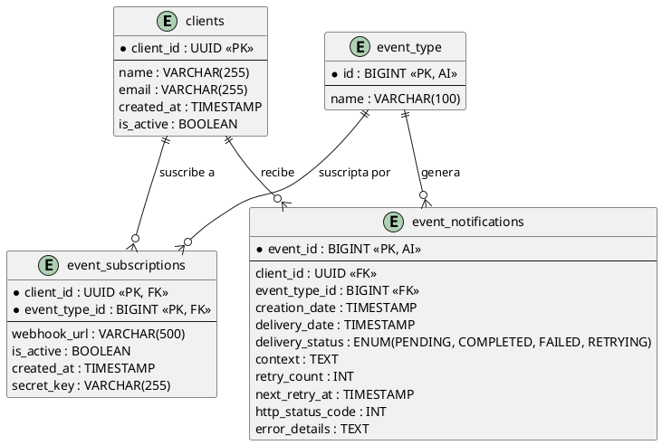

# Cobre — Sr. Software Engineer Case: Notifications

## Context

Cobre is a transactional, cloud-native, event-driven and microservices platform that manages resources for clients (accounts, payments, transactions). This challenge designs and implements a **webhook-based event notification system**.

Full requirements: [`docs/Sr_Software_Engineer_Case_-_Notifications.pdf`](docs/Sr_Software_Engineer_Case_-_Notifications.pdf)

---

## Challenge Overview

### Task 1 — System Design
Design a scalable and resilient solution covering:
- **Delivery of event notifications** via webhook to a client-specific URL.
- **Self-service API** for clients to query and replay their notifications.

### Task 2 — API Implementation
Using **Hexagonal Architecture** and **Java Spring Boot**:
- Consume events and deliver them to the appropriate webhook endpoint via HTTPS.
- REST API endpoints:
  - `GET /notification_events` — list with filters by `creation_date` and `delivery_status`.
  - `GET /notification_events/{id}` — single event detail.
  - `POST /notification_events/{id}/replay` — re-send a failed notification.

Sample data: [`docs/notification_events.json`](docs/notification_events.json)

### Task 3 — Security
Identify at least 3 OWASP Top 10 vulnerabilities and propose mitigations.

---

## Data Model

> Source: [`docs/erd.puml`](docs/erd.puml)




### Table Descriptions

| Table | Purpose |
|---|---|
| `clients` | Platform clients that receive event notifications |
| `event_type` | Catalog of event types (e.g. `balance_update`, `payment_created`) |
| `event_subscriptions` | Maps a client to the event types it subscribed to, including the target `webhook_url` |
| `event_notifications` | Audit log of every notification attempt and its delivery outcome |

### Key Design Decisions

- **`event_subscriptions` uses a composite PK** `(client_id, event_type_id)` — a client may subscribe to multiple event types; a single-column PK on `client_id` would not allow this.
- **`webhook_url` lives in `event_subscriptions`** (not in `clients`) — this gives flexibility to route different event types to different URLs per client.
- **`delivery_status` ENUM** uses `PENDING | COMPLETED | FAILED | RETRYING` instead of `created | completed | failed` — `RETRYING` allows the retry scheduler to distinguish in-flight retries from new notifications.
- **`retry_count`, `next_retry_at`** — required to implement an exponential backoff retry strategy as specified in the challenge.
- **`http_status_code`, `error_details`** — needed to diagnose failures, drive the `/replay` endpoint, and support near-real-time observability.
- **`secret_key` in `event_subscriptions`** — used to sign the webhook payload with HMAC-SHA256 so the receiver can verify authenticity.

---

## Repository Structure

```
cobre_challenge/
├── README.md
└── docs/
    ├── erd.puml                                    # PlantUML entity-relationship diagram
    ├── notification_events.json                    # Sample notification events data
    └── Sr_Software_Engineer_Case_-_Notifications.pdf  # Original challenge spec
```

---

## Self-Service API

Full spec: [`docs/openapi.yaml`](docs/openapi.yaml) (OpenAPI 3.0.3)

All endpoints require a **Bearer JWT** in `Authorization`. The `client_id` is always extracted from the token — clients cannot query each other's events.

| Method | Path | Description |
|--------|------|-------------|
| `GET` | `/notification_events` | List events with optional filters and pagination |
| `GET` | `/notification_events/{id}` | Get full detail of a single event |
| `POST` | `/notification_events/{id}/replay` | Re-queue a failed event for delivery |

### Query parameters — `GET /notification_events`

| Param | Type | Required | Description |
|-------|------|----------|-------------|
| `dateFrom` | `date-time` | No | Lower bound on `creation_date` (inclusive) |
| `dateTo` | `date-time` | No | Upper bound on `creation_date` (inclusive) |
| `status` | `enum[]` | No | One or more statuses: repeat param (`?status=FAILED&status=PENDING`) |
| `page` | `integer` | No | Page number, 1-based (default: 1) |
| `pageSize` | `integer` | No | Items per page, max 100 (default: 20) |

### HTTP response codes

| Code | Meaning |
|------|---------|
| `200` | Success |
| `202` | Replay accepted (async processing) |
| `400` | Invalid query parameters |
| `401` | Missing or expired Bearer token |
| `404` | Event not found or not owned by the caller |
| `409` | Event already `COMPLETED` — cannot replay |
| `422` | Event is `PENDING` or `RETRYING` — already in-flight |
| `500` | Unexpected server error |

---

## Progress

- [x] Data model — ERD diagram
- [x] Self-service API — OpenAPI 3.0 spec
- [ ] Task 1 — System Design
- [ ] Task 2 — API implementation (Spring Boot, Hexagonal Architecture)
- [ ] Task 3 — Security analysis (OWASP Top 10)
