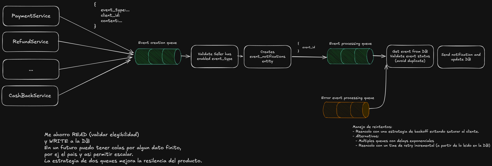

# Cobre — Sr. Software Engineer Case: Notifications

## Context

Cobre is a transactional, cloud-native, event-driven and microservices platform that manages resources for clients (accounts, payments, transactions). This challenge designs and implements a **webhook-based event notification system**.

Full requirements: [`docs/Sr_Software_Engineer_Case_-_Notifications_(1).pdf`](docs/Sr_Software_Engineer_Case_-_Notifications_(1).pdf)

> This project was designed and implemented with AI assistance. See [`PROMPTS.md`](PROMPTS.md) for the full prompt history, model, and tools used.

---

## Challenge Overview

### Task 1 — System Design
Design a scalable and resilient solution covering:
- **Delivery of event notifications** via webhook to a client-specific URL.
- **Self-service API** for clients to query and replay their notifications.



**Event creation flow:** Platform services (PaymentService, RefundService, etc.) publish events with `{event_type, client_id, content}` to an **event creation queue**. A consumer validates that the client has an active subscription for that `event_type` and, if so, persists the event and enqueues its `event_id` in the **event processing queue**.

**Event processing flow:** A worker picks up the `event_id`, loads the full event from DB, validates it hasn't already been processed (idempotency guard), delivers the webhook via HTTPS, and updates the DB with the result.

**Retry strategy:** On delivery failure the event is routed to an **error queue**. Re-enqueued with exponential backoff to avoid overwhelming the client endpoint. Two alternatives considered: multiple queues with fixed delays per level, or a single queue where the worker reads `next_retry_at` from DB before attempting delivery.

### Task 2 — API Implementation
Using **Hexagonal Architecture** and **Java Spring Boot**:
- Consume events and deliver them to the appropriate webhook endpoint via HTTPS.
- REST API endpoints:
  - `GET /notification_events` — list with filters by `creation_date` and `delivery_status`.
  - `GET /notification_events/{id}` — single event detail.
  - `POST /notification_events/{id}/replay` — re-send a failed notification.

Sample data: [`data/notification_events.json`](data/notification_events.json)


## Data Model

> Source: [`docs/erd.puml`](docs/erd.puml)


### Table Descriptions

| Table | Purpose |
|---|---|
| `clients` | Platform clients that receive event notifications |
| `event_type` | Catalog of event types (e.g. `balance_update`, `payment_created`) |
| `event_subscriptions` | Maps a client to the event types it subscribed to, including the target `webhook_url` |
| `event_notifications` | Audit log of every notification attempt and its delivery outcome |

### Key Design Decisions

- **`event_subscriptions` uses a composite PK** `(client_id, event_type_id)` — a client may subscribe to multiple event types; a single-column PK on `client_id` would not allow this.
- **`webhook_url` lives in `event_subscriptions`** (not in `clients`) — this gives flexibility to route different event types to different URLs per client.
- **`delivery_status` ENUM** uses `PENDING | COMPLETED | FAILED | RETRYING` instead of `created | completed | failed` — `RETRYING` allows the retry scheduler to distinguish in-flight retries from new notifications.
- **`retry_count`, `next_retry_at`** — required to implement an exponential backoff retry strategy as specified in the challenge.
- **`http_status_code`, `error_details`** — needed to diagnose failures, drive the `/replay` endpoint, and support near-real-time observability.
- **`secret_key` in `event_subscriptions`** — used to sign the webhook payload with HMAC-SHA256 so the receiver can verify authenticity.

---

## Repository Structure

```
challenge-webhook/
├── README.md
├── src/
│   ├── main/java/com/cobre/eventsApi/
│   │   ├── domain/                 # Entities, ports, exceptions
│   │   ├── application/            # Use case services
│   │   ├── adapter/                # REST controllers, JSON storage, webhook HTTP
│   │   └── infrastructure/         # Spring configuration (BeanConfig)
│   └── test/
├── data/
│   └── notification_events.json    # Sample data (10 events, 3 clients)
├── docs/
│   ├── openapi.yaml                # OpenAPI 3.0.3 spec
│   ├── erd.puml / erd.png          # Entity-relationship diagram
│   └── Sr_Software_Engineer_Case_-_Notifications_(1).pdf
├── bruno/                          # Bruno API collection for manual testing
├── build.gradle
└── gradlew
```

---

## Self-Service API

Full spec: [`docs/openapi.yaml`](docs/openapi.yaml) (OpenAPI 3.0.3)

All endpoints require a **Bearer JWT** in `Authorization`. The `client_id` is always extracted from the token — clients cannot query each other's events.

| Method | Path | Description |
|--------|------|-------------|
| `GET` | `/notification_events` | List events with optional filters and pagination |
| `GET` | `/notification_events/{id}` | Get full detail of a single event |
| `POST` | `/notification_events/{id}/replay` | Re-queue a failed event for delivery |

### Query parameters — `GET /notification_events`

| Param | Type | Required | Description |
|-------|------|----------|-------------|
| `dateFrom` | `date-time` | No | Lower bound on `creation_date` (inclusive) |
| `dateTo` | `date-time` | No | Upper bound on `creation_date` (inclusive) |
| `status` | `enum[]` | No | One or more statuses: repeat param (`?status=FAILED&status=PENDING`) |
| `page` | `integer` | No | Page number, 1-based (default: 1) |
| `pageSize` | `integer` | No | Items per page, max 100 (default: 20) |

### HTTP response codes

| Code | Meaning |
|------|---------|
| `200` | Success |
| `400` | Invalid query parameters |
| `401` | Missing or expired Bearer token |
| `404` | Event not found or not owned by the caller |
| `409` | Event already `COMPLETED` — cannot replay |
| `422` | Event is `PENDING` or `RETRYING` — already in-flight |
| `500` | Unexpected server error |

---

## Running the API

**Prerequisites:** Java 26, Gradle

```bash
cd eventsApi
./gradlew bootRun
```

The API starts on `http://localhost:8080`.

**Generate a test JWT** (no signature validation — `client_id` extracted from payload):

```bash
# CLIENT001 token
TOKEN="eyJhbGciOiJub25lIn0.eyJjbGllbnRfaWQiOiJDTElFTlQwMDEifQ."

# List events
curl -H "Authorization: Bearer $TOKEN" http://localhost:8080/notification_events

# Get single event
curl -H "Authorization: Bearer $TOKEN" http://localhost:8080/notification_events/EVT001

# Replay a failed event
curl -X POST -H "Authorization: Bearer $TOKEN" http://localhost:8080/notification_events/EVT003/replay
```

**Run tests:**

```bash
cd eventsApi
./gradlew test
```

22 tests: 7 unit (ListService) + 7 unit (ReplayService) + 7 integration (Controller) + 1 smoke.

**Bruno collection** (manual / exploratory testing):

The [`bruno/`](bruno/) folder contains a ready-to-use [Bruno](https://www.usebruno.com/) collection with 14 requests covering all endpoints, filters, error codes and auth scenarios. Open the `bruno/` folder as a collection in Bruno and select the `local` environment.

| # | Request | Scenario |
|---|---------|----------|
| 01 | List Events | Happy path |
| 02 | List Events — Filter by Status | `?status=FAILED` |
| 03 | List Events — Multi Status Filter | `?status=FAILED&status=PENDING` |
| 04 | List Events — Filter by Date Range | `dateFrom` / `dateTo` |
| 05 | List Events — Pagination | `page` / `pageSize` |
| 06 | Get Event | Happy path |
| 07 | Get Event — Not Found | 404 |
| 08 | Get Event — Wrong Client | Ownership isolation |
| 09 | Replay Event — FAILED | Happy path |
| 10 | Replay Event — Already Completed | 409 |
| 11 | Replay Event — Not Found | 404 |
| 12 | Unauthorized — Missing Token | 401 |
| 13 | Unauthorized — Malformed Token | 401 |
| 14 | Bad Request — Invalid Date Format | 400 |

---

## Architecture

Hexagonal (Ports & Adapters):

```
domain/        ← Pure Java: records, enums, port interfaces, exceptions
application/   ← Use case services (plain Java, no Spring annotations)
adapter/in/    ← REST controller, JWT extractor, exception handler, DTOs
adapter/out/   ← JSON file storage, HTTP webhook delivery (RestClient)
infrastructure/← BeanConfig wires adapters to use cases
```

Storage is a JSON file (`data/notification_events.json`) loaded into memory at startup. The `NotificationEventRepository` port abstracts the storage so a real database can be plugged in without touching domain or application code.


## Security analysis (OWASP Top 10)

Three OWASP Top 10 vulnerabilities identified for this API and their mitigations:

#### A08 — Software and Data Integrity Failures

When Cobre delivers a webhook notification to a client's URL, the receiver has no way to verify the payload actually came from Cobre and wasn't tampered with in transit.

**Mitigation:** Each client subscription stores a `secret_key`. Before delivering the webhook, the platform computes an HMAC-SHA256 signature of the request body using that key and includes it in a `X-Cobre-Signature` header. The client verifies the signature on their end before processing the payload.

```
X-Cobre-Signature: sha256=<hmac_hex>
```

#### A10 — Server-Side Request Forgery (SSRF)

The platform makes outbound HTTP requests to client-configured `webhook_url` values. A malicious client could register a URL pointing to an internal service (`http://10.0.0.1/admin`, `http://169.254.169.254/latest/meta-data/`) causing the platform to unknowingly proxy requests to internal infrastructure.

**Mitigation:** Maintain an allowlist of permitted webhook URL patterns. Enforce HTTPS-only. Reject URLs that resolve to private, loopback, or link-local IP ranges (RFC 1918 / RFC 3927) before making any outbound request.

#### A02 — Cryptographic Failures / Sensitive Data Exposure

Without authentication, any caller could query any client's notification history, exposing transaction details and event content.

**Mitigation:** All endpoints require a Bearer JWT. The `client_id` claim is extracted from the token and used to scope every query — a client can only access its own events. While this implementation parses the JWT payload without validating the signature (acceptable for this challenge scope), in production the signature must be verified against the identity provider's public key to guarantee the token wasn't forged.


